# Git Hooks & Husky - Complete Guide

> Learn how to enforce code quality standards and prevent bad commits using Git Hooks and Husky

## 📋 Table of Contents

- [Introduction](#introduction)
- [What are Git Hooks?](#what-are-git-hooks)
- [The Problem](#the-problem)
- [The Solution](#the-solution)
- [Available Git Hooks](#available-git-hooks)
- [Setting Up Husky](#setting-up-husky)
- [Practical Implementation](#practical-implementation)
- [Real-World Example](#real-world-example)
- [Lint-Staged Integration](#lint-staged-integration)
- [Best Practices](#best-practices)
- [Benefits](#benefits)

---

## Introduction

**What you'll learn:**
- ✅ What Git Hooks are and why they're essential
- ✅ How to use Husky to manage Git Hooks
- ✅ Enforcing code quality before commits
- ✅ Running tests automatically before commits
- ✅ Optimizing linting with lint-staged
- ✅ Team and solo development benefits

> 💡 **Important**: Git Hooks are beneficial for both team environments and solo developers!

---

## What are Git Hooks?

Git Hooks are **scripts that run automatically** at specific points in the Git workflow. They allow you to enforce quality checks before code reaches your repository.

### Simple Concept

```
Your Code → Git Add → Git Commit → [Git Hooks Run Here] → Remote Repository → Deployment
```

### The Workflow

1. **Write code** locally
2. **Commit changes** with `git commit`
3. **Git Hooks execute** (tests, linting, formatting)
4. **Only if hooks pass** → Commit succeeds
5. **Push to remote** repository (GitHub/GitLab)
6. **Deploy** to staging/production

---

## The Problem

### ❌ Without Git Hooks

```javascript
// Developer writes code
const normalizeInput = (input) => {
  // Some logic here
  // ... maybe buggy code
};

// Developer commits directly
git add .
git commit -m "add new feature"  // ✅ Commits successfully
git push                          // ✅ Pushes successfully

// Problems:
// - No tests ran
// - No linting checks
// - No formatting validation
// - Low-quality code reaches repository
```

### Issues:
- 🚫 Developers can commit without running tests
- 🚫 Code formatting inconsistencies
- 🚫 Linting errors slip through
- 🚫 Breaking changes reach the remote repository
- 🚫 Low-quality code in production

---

## The Solution

### ✅ With Git Hooks (Husky)

```javascript
// Developer writes code
const normalizeInput = (input) => {
  // Code here
};

// Developer tries to commit
git add .
git commit -m "add new feature"

// Git Hooks automatically run:
// 1. Running tests...      ✓ Passed
// 2. Running linting...    ✓ Passed
// 3. Running formatting... ✓ Passed

// ✅ Commit succeeds only if all checks pass
```

### Goals:
- ✅ Ensure **high-quality code** in remote repository
- ✅ Run **tests** before every commit
- ✅ Enforce **code formatting** standards
- ✅ Check **linting rules**
- ✅ Prevent **breaking changes** from being committed

---

## Available Git Hooks

Git provides several built-in hooks. Here are the most commonly used:

| Hook Name | Trigger Point | Use Case |
|-----------|---------------|----------|
| `pre-commit` | Before commit is created | Run tests, linting, formatting |
| `pre-push` | Before pushing to remote | Final validation before push |
| `commit-msg` | After commit message entered | Validate commit message format |
| `pre-merge-commit` | Before merge commit | Run checks during PR merges |
| `post-commit` | After commit is created | Notifications, logging |
| `post-checkout` | After checking out a branch | Setup tasks, cleanups |
| `pre-rebase` | Before rebasing | Validation before rebase |

### Most Important: `pre-commit`

The `pre-commit` hook runs **before** a commit is created, making it perfect for:
- Running unit tests
- Checking code formatting
- Running linters
- Validating code quality

---

## Setting Up Husky

### What is Husky?

[Husky](https://typicode.github.io/husky/) is a tool that makes Git Hooks **easy to use** and **fast**.

**Features:**
- ⚡ Ultra-fast and modern
- 📦 Only 2KB in size
- 🖥️ Works on Mac, Linux, Windows
- 🔧 Easy to configure
- 👥 Great for teams

### Installation

#### Step 1: Install Husky

```bash
# Using npm
npm install --save-dev husky

# Using pnpm
pnpm add -D husky

# Using yarn
yarn add -D husky
```

#### Step 2: Initialize Husky

```bash
npx husky init
```

This creates:
- `.husky/` folder in your project
- Pre-configured `pre-commit` hook
- Shell scripts ready to use

#### Step 3: Verify Installation

Check the `.husky/` folder:

```bash
.husky/
├── _/
└── pre-commit    # Default pre-commit hook
```

---

## Practical Implementation

### Project Setup

Let's say you have a simple Node.js project:

```javascript
// normalize-input.js
function normalizeInput(input) {
  // Trim whitespace
  let normalized = input.trim();
  
  // Remove extra spaces
  normalized = normalized.replace(/\s+/g, ' ');
  
  // Capitalize each word
  normalized = normalized
    .split(' ')
    .map(word => word.charAt(0).toUpperCase() + word.slice(1).toLowerCase())
    .join(' ');
  
  return normalized;
}

module.exports = { normalizeInput };
```

### Unit Tests

```javascript
// normalize-input.test.js
const { normalizeInput } = require('./normalize-input');

test('should trim whitespace', () => {
  expect(normalizeInput('  hello  ')).toBe('Hello');
});

test('should remove extra spaces', () => {
  expect(normalizeInput('hello    world')).toBe('Hello World');
});

test('should capitalize each word', () => {
  expect(normalizeInput('code gyan')).toBe('Code Gyan');
});
```

### Package.json Scripts

```json
{
  "scripts": {
    "test": "node --test",
    "lint": "eslint .",
    "format": "prettier --write ."
  },
  "devDependencies": {
    "husky": "^9.0.0"
  }
}
```

### Configure Pre-commit Hook

Edit `.husky/pre-commit`:

```bash
#!/usr/bin/env sh
. "$(dirname -- "$0")/_/husky.sh"

# Run tests before commit
npm test

# Run linting (optional)
npm run lint

# Run formatting (optional)
npm run format
```

---

## Real-World Example

### Scenario: Breaking Change

#### Without Git Hooks ❌

```javascript
// Developer comments out capitalization
function normalizeInput(input) {
  let normalized = input.trim();
  normalized = normalized.replace(/\s+/g, ' ');
  
  // Developer comments this out for a "new feature"
  // normalized = normalized
  //   .split(' ')
  //   .map(word => word.charAt(0).toUpperCase() + word.slice(1).toLowerCase())
  //   .join(' ');
  
  return normalized;
}

// Developer commits
git add .
git commit -m "add new feature"  // ✅ Commits successfully!
// But tests are broken! Application breaks in production! 💥
```

#### With Git Hooks (Husky) ✅

```bash
# Developer tries to commit
git add .
git commit -m "add new feature"

# Husky runs pre-commit hook
Running tests...
✗ Test failed: should capitalize each word
  Expected: "Code Gyan"
  Received: "code gyan"

# ❌ Commit blocked!
# Developer must fix the issue before committing
```

```javascript
// Developer creates a new function instead
function normalizeInputWithoutCapitalization(input) {
  let normalized = input.trim();
  normalized = normalized.replace(/\s+/g, ' ');
  return normalized;
}

// Original function remains unchanged
function normalizeInput(input) {
  // All original logic intact
  // ...
}

// Now commit succeeds
git add .
git commit -m "add normalize without capitalization"

Running tests...
✓ All tests passed (3/3)

✅ Commit successful!
```

---

## Lint-Staged Integration

### The Problem

Running linting on the **entire project** every commit is slow:

```bash
npm run lint  # Checks ALL files in project ❌ Slow!
```

### The Solution: lint-staged

[lint-staged](https://github.com/okonet/lint-staged) runs linters **only on staged files**:

```bash
# Only checks files you're committing ✅ Fast!
```

### Installation

```bash
npm install --save-dev lint-staged
```

### Configuration

Create `.lintstagedrc.json`:

```json
{
  "*.js": [
    "eslint --fix",
    "prettier --write"
  ],
  "*.{json,md}": [
    "prettier --write"
  ]
}
```

### Update Pre-commit Hook

Edit `.husky/pre-commit`:

```bash
#!/usr/bin/env sh
. "$(dirname -- "$0")/_/husky.sh"

# Run tests on all code
npm test

# Run linting and formatting only on staged files
npx lint-staged
```

### Package.json Configuration

```json
{
  "scripts": {
    "test": "node --test",
    "prepare": "husky install"
  },
  "lint-staged": {
    "*.js": [
      "eslint --fix",
      "prettier --write"
    ]
  },
  "devDependencies": {
    "husky": "^9.0.0",
    "lint-staged": "^15.0.0",
    "eslint": "^8.0.0",
    "prettier": "^3.0.0"
  }
}
```

---

## Best Practices

### 1. Keep Hooks Fast ⚡

```bash
# Good ✅
npm test                    # Only unit tests
npx lint-staged             # Only staged files

# Bad ❌
npm run test:e2e            # Slow end-to-end tests
npm run lint                # Entire project
```

### 2. Use Multiple Hooks

```bash
# .husky/pre-commit
npm test
npx lint-staged

# .husky/pre-push
npm run test:integration
npm run build
```

### 3. Document Your Hooks

Add a README in `.husky/`:

```markdown
# Git Hooks

## pre-commit
- Runs unit tests
- Lints and formats staged files

## pre-push
- Runs integration tests
- Validates build
```

### 4. Make Hooks Skippable (Emergency Only)

```bash
# Skip hooks in emergency (use carefully!)
git commit --no-verify -m "hotfix: critical bug"
```

### 5. Team Configuration

Commit `.husky/` folder to version control:

```bash
git add .husky/
git commit -m "chore: add git hooks"
git push
```

Now all team members get the same hooks automatically!

---

## Benefits

### For Teams 👥

| Benefit | Description |
|---------|-------------|
| **Consistent Code Quality** | Everyone follows same standards |
| **Reduced Code Review Time** | Automated checks catch issues early |
| **Prevent Breaking Changes** | Tests run before code reaches repository |
| **Standardized Workflow** | All developers use same process |
| **Less Merge Conflicts** | Consistent formatting reduces conflicts |

### For Solo Developers 🧑‍💻

| Benefit | Description |
|---------|-------------|
| **Catch Bugs Early** | Tests run automatically |
| **Maintain Standards** | Even when working alone |
| **Build Good Habits** | Enforce discipline |
| **Professional Setup** | Production-ready configuration |
| **Save Time** | Automated checks prevent mistakes |

### Key Advantages ⭐

- ✅ **High-quality code** in repository
- ✅ **Automated testing** before every commit
- ✅ **Consistent formatting** across project
- ✅ **Early bug detection** before deployment
- ✅ **Enforced standards** without manual checks
- ✅ **Faster code reviews** with automated checks
- ✅ **Reduced production bugs** through prevention

---

## Common Git Hooks Workflow

```mermaid
graph TD
    A[Write Code] --> B[git add .]
    B --> C[git commit]
    C --> D{pre-commit Hook}
    D -->|Run Tests| E{Tests Pass?}
    E -->|No| F[❌ Commit Blocked]
    E -->|Yes| G{Run Linting}
    G -->|Pass| H{Run Formatting}
    G -->|Fail| F
    H -->|Pass| I[✅ Commit Success]
    H -->|Fail| F
    F --> A
    I --> J[git push]
    J --> K{pre-push Hook}
    K -->|Pass| L[✅ Push Success]
    K -->|Fail| M[❌ Push Blocked]
    M --> A
```



---

## Quick Start Guide

### 1. Initialize Git Repository

```bash
git init
```

### 2. Install Husky

```bash
npm install --save-dev husky
npx husky init
```

### 3. Install lint-staged

```bash
npm install --save-dev lint-staged
```

### 4. Configure Package.json

```json
{
  "scripts": {
    "test": "node --test",
    "prepare": "husky install"
  },
  "lint-staged": {
    "*.js": ["eslint --fix", "prettier --write"]
  }
}
```

### 5. Update .husky/pre-commit

```bash
#!/usr/bin/env sh
. "$(dirname -- "$0")/_/husky.sh"

npm test
npx lint-staged
```

### 6. Test It

```bash
# Make changes
echo "console.log('test')" >> test.js

# Try to commit
git add .
git commit -m "test commit"

# Hooks will run automatically!
```

---

## Troubleshooting

### Hook Not Running?

```bash
# Make hook executable
chmod +x .husky/pre-commit

# Reinstall husky
npm run prepare
```

### Skip Hooks (Emergency)

```bash
# Use with caution!
git commit --no-verify -m "emergency fix"
```

### Hook Fails But You Need to Commit

```bash
# Fix the issue first
npm test  # See what's failing

# Then commit normally
git commit -m "fix: resolved issues"
```

---

## Real Production Setup

For a complete production-ready setup including:
- TypeScript configuration
- ESLint setup
- Prettier configuration
- Testing setup
- Microservices architecture
- Advanced Git Hooks

Check out the **Production Ready Full Stack Engineer Program** mentioned in the video.

---

## Resources

### Official Documentation
- [Git Hooks Documentation](https://git-scm.com/docs/githooks)
- [Husky Official Site](https://typicode.github.io/husky/)
- [lint-staged GitHub](https://github.com/okonet/lint-staged)

### Related Topics
- [Unit Testing in Node.js](https://nodejs.org/api/test.html)
- [ESLint Documentation](https://eslint.org/)
- [Prettier Documentation](https://prettier.io/)

---

## Summary

Git Hooks with Husky help you:

1. ✅ **Enforce code quality** automatically
2. ✅ **Run tests** before every commit
3. ✅ **Maintain consistency** across team
4. ✅ **Catch bugs early** in development
5. ✅ **Prevent bad code** from reaching repository

**Essential for:**
- Production applications
- Team projects
- Open source projects
- Professional development
- Solo projects requiring discipline

---

## 📝 Credits

**Channel**: Code Gyan (कोड ज्ञान)  
**Topic**: Git Hooks and Husky Setup

---

## 🤝 Contributing

Feel free to suggest improvements or report issues!

---

<div align="center">

**Made with ❤️ for developers who care about code quality**

⭐ Star this guide if you found it helpful!

</div>