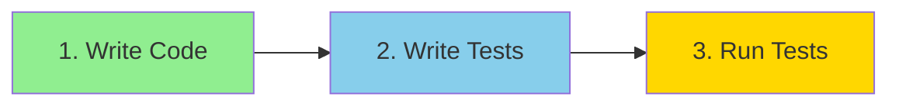
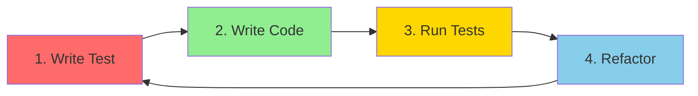

# Test-Driven Development (TDD) - Complete Guide

> Master Test-Driven Development: Write tests first, then code. Build bug-free, maintainable applications with confidence.

## 📋 Table of Contents

- [Introduction](#introduction)
- [What is Application Testing?](#what-is-application-testing)
- [Why Automated Testing?](#why-automated-testing)
- [Testing Approaches](#testing-approaches)
- [What is TDD?](#what-is-test-driven-development-tdd)
- [TDD Workflow](#tdd-workflow-red-green-refactor)
- [Traditional Testing Example](#traditional-testing-example)
- [TDD in Practice](#tdd-in-practice-step-by-step)
- [Complete TDD Example](#complete-tdd-example)
- [Benefits of TDD](#benefits-of-tdd)
- [Best Practices](#best-practices)
- [Real-World Application](#real-world-application)

---

## Introduction

**What you'll learn:**
- ✅ What automated testing is and why it's essential
- ✅ The difference between traditional testing and TDD
- ✅ How to write tests before code (Test-Driven Development)
- ✅ Red-Green-Refactor cycle
- ✅ Practical TDD implementation with real examples
- ✅ Edge case handling and design thinking

> 💡 **Key Insight**: TDD makes you think about design, edge cases, and architecture BEFORE writing code!

---

## What is Application Testing?

### The Concept

```javascript
// You write code
function someFunction(input) {
  // Logic here
  return output;
}

// Testing checks:
// ✅ Does expected input produce expected output?
// ✅ Does it handle edge cases?
// ✅ Does it break with invalid input?
```

### Definition

**Application Testing** means:
1. Writing functions/code
2. Testing different inputs
3. Verifying outputs match expectations
4. Automating this process with code

### Unit Testing

Testing the **smallest unit** of code (a function) is called **Unit Testing**.

```javascript
// Unit: A single function
function getFullName(firstName, lastName) {
  return `${firstName} ${lastName}`;
}

// Unit Test: Test this single function
test('should return full name', () => {
  const result = getFullName('Code', 'Gyan');
  assert.strictEqual(result, 'Code Gyan');
});
```

---

## Why Automated Testing?

### The Problem Without Testing

#### Scenario: Building Features

```
Feature A (Login) → Tester Tests → Deploy ✅
Feature B (Forgot Password) → Tester Tests → Deploy ✅
Feature C (New Feature) → Tester Tests → Deploy ✅

❌ CLIENT EMAIL: "Login is broken!"
```

**What happened?**
- Feature C accidentally broke Feature A
- Tester only tested Feature C, not A & B
- Bug reached production

### The Manual Testing Problem

```
Application with 1000s of features
↓
New feature added
↓
Manually test ALL 1000 features? ❌ IMPOSSIBLE!
```

### The Solution: Automated Testing

```bash
# Write code
npm test  # Runs ALL tests automatically

# Results:
✅ Feature A tests: PASS
✅ Feature B tests: PASS  
✅ Feature C tests: PASS
✅ All 1000 tests: PASS in 5 seconds!
```

### Benefits

| Manual Testing | Automated Testing |
|----------------|-------------------|
| Slow and tedious | Fast (seconds) |
| Human error-prone | Consistent |
| Can't test everything | Tests everything |
| Boring repetitive work | Automated |
| Expensive | Cost-effective |

---

## Testing Approaches

### Type 1: Traditional Testing (Code First)



**Process:**
1. Write the function/feature
2. Write tests for it
3. Run tests to verify

### Type 2: Test-Driven Development (TDD)



**Process:**
1. Write test FIRST (it will fail)
2. Write minimum code to pass test
3. Run tests (should pass)
4. Refactor and improve
5. Repeat cycle

> 🤔 **Sounds strange?** Yes! But it's incredibly powerful. Let's see why...

---

## What is Test-Driven Development (TDD)?

### The Concept

**TDD** = Write tests BEFORE writing implementation code

### Why TDD?

When you write code first:
- ❌ No design plan
- ❌ Don't think about edge cases
- ❌ Don't think about API design
- ❌ Rush to implementation

When you write tests first:
- ✅ Think about edge cases upfront
- ✅ Design your function's API
- ✅ Consider all scenarios
- ✅ Become the "architect" of your code

---

## TDD Workflow: Red-Green-Refactor

### The Complete Cycle

```
Feature 1 → Write Test → Run (RED ❌ Fails) → Write Minimal Code → Run (GREEN ✅ Pass) → Refactor → Repeat
```

### Step-by-Step

#### 1️⃣ RED Phase: Write Test (Fails)

```javascript
test('should trim spaces', () => {
  const result = normalizeInput('  hello  ');
  assert.strictEqual(result, 'hello');
});
```

Run test: ❌ **FAILS** (function doesn't exist yet)

#### 2️⃣ GREEN Phase: Write Minimal Code (Passes)

```javascript
function normalizeInput(input) {
  return input.trim(); // Minimal code to pass
}
```

Run test: ✅ **PASSES**

#### 3️⃣ REFACTOR Phase: Improve Code

```javascript
function normalizeInput(input) {
  let result = input;
  result = result.trim(); // More readable
  return result;
}
```

Run test: ✅ **Still PASSES**

#### 4️⃣ Repeat: Next Edge Case

Start again with a new test for another edge case!

---

## Traditional Testing Example

### Step 1: Write the Function

```javascript
// app.js
export function getFullName(firstName, lastName) {
  return `${firstName} ${lastName}`;
}
```

### Step 2: Manually Test

```javascript
console.log(getFullName('Code', 'Gyan')); // Manual testing
```

### Step 3: Write Automated Test

```javascript
// app.test.js
import { test } from 'node:test';
import assert from 'node:assert';
import { getFullName } from './app.js';

test('should return full name', () => {
  // Arrange
  const result = getFullName('Code', 'Gyan');
  
  // Assert
  const expected = 'Code Gyan';
  assert.strictEqual(result, expected);
});
```

### Step 4: Run Tests

```bash
node --test

# Output:
✓ should return full name
```

### What if it fails?

```javascript
// Changed implementation (removed space)
return `${firstName}${lastName}`; // BUG!

// Run test:
node --test

# Output:
✗ should return full name
  Expected: "Code Gyan"
  Received: "CodeGyan"
```

---

## TDD in Practice: Step-by-Step

### The Requirement

Build a `normalizeInput()` function that:
- Trims leading/trailing spaces
- Removes extra whitespace
- Capitalizes each word
- Handles empty input

### Setting Up

```javascript
// app.test.js
import { test } from 'node:test';
import assert from 'node:assert';
import { normalizeInput } from './app.js';
```

---

## Complete TDD Example

### Edge Case 1: Trim Spaces

#### 🔴 RED: Write Test (Fails)

```javascript
test('should trim spaces', () => {
  const result = normalizeInput('  code gyan  ');
  const expected = 'code gyan';
  assert.strictEqual(result, expected);
});
```

Run: `node --test` → ❌ **FAILS** (function doesn't exist)

#### 🟢 GREEN: Write Minimal Code (Passes)

```javascript
// app.js
export function normalizeInput(input) {
  return input.trim(); // Minimal code
}
```

Run: `node --test` → ✅ **PASSES**

#### 🔵 REFACTOR: Improve Code

```javascript
export function normalizeInput(input) {
  let result = input;
  result = result.trim(); // More readable
  return result;
}
```

Run: `node --test` → ✅ **Still PASSES**

---

### Edge Case 2: Handle Empty Input

#### 🔴 RED: Write Test (Fails)

```javascript
test('should return empty string if input does not exist', () => {
  const result = normalizeInput(); // No input
  const expected = '';
  assert.strictEqual(result, expected);
});
```

Run: `node --test` → ❌ **FAILS**

```
Error: Cannot read property 'trim' of undefined
```

#### 🟢 GREEN: Write Minimal Code (Passes)

```javascript
export function normalizeInput(input) {
  // Handle undefined/null input
  if (!input) {
    return '';
  }
  
  let result = input;
  result = result.trim();
  return result;
}
```

Run: `node --test` → ✅ **PASSES**

---

### Edge Case 3: Remove Extra Whitespace

#### 🔴 RED: Write Test (Fails)

```javascript
test('should remove extra whitespaces', () => {
  const result = normalizeInput('code     gyan');
  const expected = 'code gyan';
  assert.strictEqual(result, expected);
});
```

Run: `node --test` → ❌ **FAILS**

```
Expected: "code gyan"
Received: "code     gyan"
```

#### 🟢 GREEN: Write Minimal Code (Passes)

```javascript
export function normalizeInput(input) {
  if (!input) {
    return '';
  }
  
  let result = input;
  result = result.trim();
  
  // Remove extra whitespace
  result = result.replace(/\s+/g, ' ');
  
  return result;
}
```

> **Regex Explanation**: `/\s+/g`
> - `\s` = whitespace character
> - `+` = one or more
> - `g` = global (all occurrences)

Run: `node --test` → ✅ **PASSES**

---

### Edge Case 4: Capitalize Words

#### 🔴 RED: Write Test (Fails)

```javascript
test('should capitalize the input', () => {
  const result = normalizeInput('code gyan');
  const expected = 'Code Gyan';
  assert.strictEqual(result, expected);
});
```

Run: `node --test` → ❌ **FAILS**

```
Expected: "Code Gyan"
Received: "code gyan"
```

#### 🟢 GREEN: Write Code (Passes)

```javascript
export function normalizeInput(input) {
  if (!input) {
    return '';
  }
  
  let result = input;
  result = result.trim();
  result = result.replace(/\s+/g, ' ');
  
  // Capitalize each word
  result = result
    .split(' ')
    .filter(Boolean) // Remove falsy values
    .map(word => {
      return word.charAt(0).toUpperCase() + word.slice(1).toLowerCase();
    })
    .join(' ');
  
  return result;
}
```

**Logic Breakdown:**

```javascript
'code gyan'
  .split(' ')           // ['code', 'gyan']
  .filter(Boolean)      // Remove empty strings
  .map(word => {
    word.charAt(0)      // 'c'
      .toUpperCase()    // 'C'
    + word.slice(1)     // 'ode'
      .toLowerCase()    // 'ode'
    // Result: 'Code'
  })                    // ['Code', 'Gyan']
  .join(' ')            // 'Code Gyan'
```

Run: `node --test` → ✅ **ALL 4 TESTS PASS!**

---

## Final Implementation

### Complete Code

```javascript
// app.js
export function normalizeInput(input) {
  // Edge case: Handle undefined/null
  if (!input) {
    return '';
  }
  
  let result = input;
  
  // Edge case: Trim leading/trailing spaces
  result = result.trim();
  
  // Edge case: Remove extra whitespace
  result = result.replace(/\s+/g, ' ');
  
  // Edge case: Capitalize each word
  result = result
    .split(' ')
    .filter(Boolean)
    .map(word => {
      return word.charAt(0).toUpperCase() + word.slice(1).toLowerCase();
    })
    .join(' ');
  
  return result;
}
```

### All Tests

```javascript
// app.test.js
import { test } from 'node:test';
import assert from 'node:assert';
import { normalizeInput } from './app.js';

test('should trim spaces', () => {
  const result = normalizeInput('  code gyan  ');
  assert.strictEqual(result, 'Code Gyan');
});

test('should return empty string if input does not exist', () => {
  const result = normalizeInput();
  assert.strictEqual(result, '');
});

test('should remove extra whitespaces', () => {
  const result = normalizeInput('code     gyan');
  assert.strictEqual(result, 'Code Gyan');
});

test('should capitalize the input', () => {
  const result = normalizeInput('code gyan');
  assert.strictEqual(result, 'Code Gyan');
});
```

### Run All Tests

```bash
node --test

# Output:
✓ should trim spaces
✓ should return empty string if input does not exist
✓ should remove extra whitespaces
✓ should capitalize the input

4 tests passed
```

---

## Benefits of TDD

### 🎯 Design Thinking

**Without TDD:**
```javascript
// Jump straight to implementation
function normalize(input) {
  // Hmm, what about edge cases? 🤔
  // Oh well, I'll fix them later...
}
```

**With TDD:**
```javascript
// Think about design FIRST
// - What inputs are possible?
// - What outputs are expected?
// - What edge cases exist?
// - How should the API look?

test('what if input is undefined?', () => {
  // Forces you to think!
});
```

### ✅ Comprehensive Testing

| Approach | Coverage |
|----------|----------|
| No Tests | 0% - Hope it works |
| Manual Testing | ~30% - Test happy path |
| Traditional Tests | ~60% - Test after coding |
| **TDD** | **90%+** - Test WHILE designing |

### 🔒 Confidence

```javascript
// Made changes to code?
npm test

✓ All 50 tests pass in 2 seconds
// Ship with confidence! 🚀
```

### 🛡️ Regression Prevention

```javascript
// 6 months later, someone modifies function
npm test

✗ 5 tests failed
// Catches breaking changes immediately!
```

### 📚 Documentation

Tests serve as **living documentation**:

```javascript
test('should capitalize each word', () => {
  // Anyone reading this knows EXACTLY what function does
  const result = normalizeInput('hello world');
  assert.strictEqual(result, 'Hello World');
});
```

### 🏗️ Better Architecture

TDD forces:
- ✅ Single Responsibility Principle
- ✅ Loose Coupling
- ✅ Easy to Test = Easy to Understand
- ✅ Modular Design

---

## TDD vs Traditional Testing

### Traditional: Code First

```javascript
// 1. Write implementation (30 min)
function complexFunction(a, b, c) {
  // 100 lines of complex logic
  // Didn't think about edge cases
  // Tight coupling
  // Hard to test
}

// 2. Try to write tests (1 hour)
test('should do something?', () => {
  // Hard to test because of poor design
  // Need to mock everything
  // Tests are fragile
});
```

### TDD: Test First

```javascript
// 1. Write test (5 min)
test('should handle null input', () => {
  const result = complexFunction(null);
  assert.strictEqual(result, defaultValue);
});

// 2. Write minimal code (10 min)
function complexFunction(input) {
  if (!input) return defaultValue;
  // Forces good design
  // Testable from start
  // Clear requirements
}
```

---

## Best Practices

### 1. Keep Tests Simple

```javascript
// ❌ BAD: Complex test
test('should do everything', () => {
  const result = doManyThings(input1, input2, input3);
  assert.ok(result.thing1 && result.thing2 && result.thing3);
});

// ✅ GOOD: One test, one assertion
test('should return correct thing1', () => {
  const result = doManyThings(input);
  assert.strictEqual(result.thing1, expected);
});
```

### 2. Descriptive Test Names

```javascript
// ❌ BAD
test('test1', () => {});
test('works', () => {});

// ✅ GOOD
test('should trim leading and trailing spaces', () => {});
test('should return empty string when input is undefined', () => {});
test('should capitalize first letter of each word', () => {});
```

### 3. Arrange-Act-Assert (AAA) Pattern

```javascript
test('should calculate total price', () => {
  // Arrange: Setup
  const items = [{ price: 10 }, { price: 20 }];
  
  // Act: Execute
  const result = calculateTotal(items);
  
  // Assert: Verify
  assert.strictEqual(result, 30);
});
```

### 4. Test Edge Cases

```javascript
// Not just happy path:
test('should handle empty array', () => {});
test('should handle null input', () => {});
test('should handle undefined input', () => {});
test('should handle very large numbers', () => {});
test('should handle negative numbers', () => {});
test('should handle special characters', () => {});
```

### 5. Red-Green-Refactor Discipline

```bash
# Always follow the cycle:
1. Write test → RED ❌
2. Make it pass → GREEN ✅
3. Improve code → REFACTOR 🔵
4. Repeat
```

---

## Real-World Application

### Without TDD

```javascript
// Developer writes feature
// Manual testing in browser
// Looks good! 
// Push to production
// Bug found in production 💥
// Emergency fix
// More bugs introduced
// Cycle continues...
```

### With TDD

```javascript
// Developer writes tests for all edge cases
// Writes implementation to pass tests
// All tests pass ✅
// Push to production
// Confident deployment
// Bug found? Add failing test → Fix → All tests pass
// No regression!
```

### TDD in Teams

```javascript
// Team Member A: Adds feature
npm test // ✅ All tests pass

// Team Member B: Modifies code 6 months later
npm test // ✗ 3 tests fail (broke Feature A)

// Member B: Fixes issues
npm test // ✅ All tests pass

// No surprise bugs in production! 🎉
```

---

## Testing Tools

### Node.js Built-in Test Runner

```javascript
import { test } from 'node:test';
import assert from 'node:assert';

test('my test', () => {
  assert.strictEqual(1 + 1, 2);
});
```

**Run:**
```bash
node --test
```

### Other Popular Testing Tools

| Tool | Description |
|------|-------------|
| **Vitest** | Fast, modern test runner |
| **Jest** | Most popular, full-featured |
| **Mocha** | Flexible, minimal |
| **Jasmine** | Behavior-driven testing |

---

## Quick Start Guide

### 1. Create Project

```bash
mkdir tdd-demo
cd tdd-demo
npm init -y
```

### 2. Create Files

```bash
touch app.js
touch app.test.js
```

### 3. Write Test First

```javascript
// app.test.js
import { test } from 'node:test';
import assert from 'node:assert';
import { add } from './app.js';

test('should add two numbers', () => {
  const result = add(2, 3);
  assert.strictEqual(result, 5);
});
```

### 4. Run Test (RED)

```bash
node --test
# ❌ Error: Cannot find module './app.js'
```

### 5. Write Minimal Code (GREEN)

```javascript
// app.js
export function add(a, b) {
  return a + b;
}
```

### 6. Run Test Again

```bash
node --test
# ✅ should add two numbers
```

### 7. Add More Tests

```javascript
test('should handle negative numbers', () => {
  const result = add(-5, 3);
  assert.strictEqual(result, -2);
});

test('should handle zero', () => {
  const result = add(0, 0);
  assert.strictEqual(result, 0);
});
```

---

## Common Mistakes

### ❌ Mistake 1: Writing Too Much Code

```javascript
// RED: Test fails
test('should trim spaces', () => {
  const result = normalize('  hello  ');
  assert.strictEqual(result, 'hello');
});

// ❌ BAD: Implementing everything at once
function normalize(input) {
  return input.trim().toUpperCase().replace(/\s+/g, '');
  // Too much! Only trim was needed
}

// ✅ GOOD: Minimal code
function normalize(input) {
  return input.trim(); // Just enough to pass
}
```

### ❌ Mistake 2: Skipping Tests

```javascript
// ❌ "I'll add tests later..."
// (Never happens)

// ✅ Tests FIRST, always!
```

### ❌ Mistake 3: Testing Implementation

```javascript
// ❌ BAD: Testing HOW it works
test('should use regex to remove spaces', () => {
  // Testing implementation details
});

// ✅ GOOD: Testing WHAT it does
test('should remove extra spaces', () => {
  const result = normalize('a    b');
  assert.strictEqual(result, 'a b');
});
```

---

## Summary

### The TDD Mantra

```
🔴 RED: Write a failing test
🟢 GREEN: Make it pass (minimal code)
🔵 REFACTOR: Improve the code
🔁 REPEAT: Next test
```

### Key Takeaways

1. ✅ **Tests First** = Better Design
2. ✅ **Edge Cases** = Thought through upfront
3. ✅ **Confidence** = All scenarios tested
4. ✅ **Regression** = Prevented automatically
5. ✅ **Documentation** = Tests show usage
6. ✅ **Refactoring** = Safe and fearless

### When to Use TDD

| Use TDD | Don't Need TDD |
|---------|----------------|
| Complex business logic | Simple CRUD operations |
| Edge cases critical | Prototyping/spikes |
| Long-term maintenance | Throwaway code |
| Team projects | Learning new tech |
| Critical features | UI experiments |

---

## Resources

### Official Documentation
- [Node.js Test Runner](https://nodejs.org/api/test.html)
- [Node.js Assert](https://nodejs.org/api/assert.html)

### Related Topics
- Unit Testing Fundamentals
- Integration Testing
- End-to-End Testing
- Test Coverage

### Production Setup
For production-ready applications with:
- Frontend testing (React, Vue)
- Backend testing (API tests)
- Integration tests
- E2E tests
- Real microservices project

Check out the **Production Ready Full Stack Engineer Program** for complete implementation.

---

## 📝 Credits

**Channel**: Code Gyan (कोड ज्ञान)  
**Topic**: Test-Driven Development (TDD) & Automated Testing

---

<div align="center">

**Made with ❤️ for developers who write quality code**

⭐ Master TDD and ship bug-free applications!

</div>